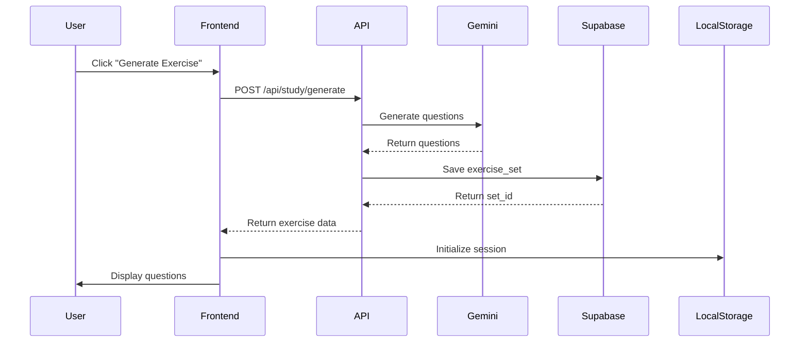
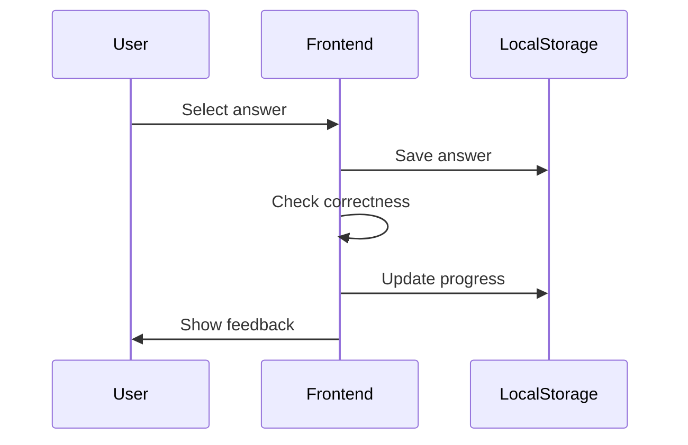
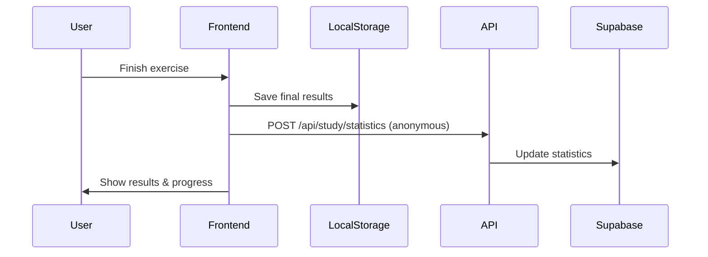

# 🎯 Kế Hoạch Tích Hợp AI Tạo Bài Tập JLPT

## 📋 Tổng Quan Dự Án

### Mục Tiêu
Tích hợp AI (Google Gemini) vào trang `/study/practice` để tự động sinh bài tập JLPT theo level, với architecture tối ưu hóa hiệu suất server.

### Nguyên Tắc Thiết Kế
- **🔒 Privacy First**: Câu trả lời của user lưu trên localStorage (không lên server)
- **☁️ Cloud Storage**: Bộ đề được AI sinh ra lưu trên Supabase để tái sử dụng
- **⚡ Performance**: Giảm tải server bằng cách phân tán data storage
- **🎨 User Experience**: Trải nghiệm mượt mà, realtime feedback

## 🏗️ Architecture Overview

```
┌─────────────────────────────────────────────────────────┐
│                     USER BROWSER                         │
├─────────────────────────────────────────────────────────┤
│  localStorage:                                          │
│  - User answers (đáp án user chọn)                      │
│  - Correct/Incorrect status (đúng/sai)                  │
│  - Personal progress (tiến độ cá nhân)                  │
│  - Practice history (lịch sử làm bài)                   │
├─────────────────────────────────────────────────────────┤
│                         ↕ API                           │
├─────────────────────────────────────────────────────────┤
│                    NEXT.JS SERVER                        │
│  - Generate exercises via Gemini AI                     │
│  - Save generated sets to Supabase                      │
│  - Fetch existing exercise sets                         │
├─────────────────────────────────────────────────────────┤
│                         ↕ Database                      │
├─────────────────────────────────────────────────────────┤
│                      SUPABASE                           │
│  Tables:                                                │
│  - exercise_sets (bộ đề AI đã sinh)                     │
│  - exercise_templates (mẫu câu hỏi)                     │
│  - vocabulary/grammar (data gốc)                        │
└─────────────────────────────────────────────────────────┘
```

## 💾 Data Storage Strategy

### 1. **Supabase (Server)**
Lưu trữ các data công khai, có thể tái sử dụng:
- ✅ Bộ đề đã được AI generate
- ✅ Vocabulary/Grammar database
- ✅ Exercise templates
- ✅ Statistics tổng quan (không personal)

### 2. **LocalStorage (Client)**
Lưu trữ data cá nhân của từng user:
- ✅ Câu trả lời user đã chọn
- ✅ Kết quả đúng/sai
- ✅ Progress tracking cá nhân
- ✅ Lịch sử làm bài
- ✅ User preferences

### Tính Khả Thi: ✅ **HOÀN TOÀN KHẢ THI**

#### Ưu điểm:
1. **Giảm tải server**: Không phải lưu hàng triệu record câu trả lời
2. **Privacy**: Data cá nhân user không lên server
3. **Performance**: LocalStorage truy cập nhanh, không cần network
4. **Cost-effective**: Tiết kiệm storage và bandwidth Supabase
5. **Offline capability**: User có thể xem lại bài đã làm offline

#### Nhược điểm và giải pháp:
- **Cross-device sync**: Không sync giữa devices → Giải pháp: Optional cloud backup
- **Data loss**: Mất data khi clear browser → Giải pháp: Export/Import feature
- **Storage limit**: LocalStorage giới hạn 5-10MB → Giải pháp: Rotation policy

## 📊 Database Schema

### Supabase Tables

```sql
-- 1. Bảng lưu bộ đề AI đã generate
CREATE TABLE exercise_sets (
  id UUID PRIMARY KEY DEFAULT gen_random_uuid(),
  level VARCHAR(10) NOT NULL, -- n5, n4, n3, n2, n1
  type VARCHAR(50) NOT NULL, -- vocabulary, grammar, reading, kanji
  questions JSONB NOT NULL, -- Array of questions
  metadata JSONB, -- Additional info (difficulty, tags, etc)
  generated_by VARCHAR(100), -- AI model used
  usage_count INTEGER DEFAULT 0, -- Track popularity
  created_at TIMESTAMP DEFAULT NOW(),
  updated_at TIMESTAMP DEFAULT NOW()
);

-- Index for fast queries
CREATE INDEX idx_exercise_sets_level_type ON exercise_sets(level, type);
CREATE INDEX idx_exercise_sets_created_at ON exercise_sets(created_at DESC);

-- 2. Vocabulary/Grammar source data
CREATE TABLE study_materials (
  id UUID PRIMARY KEY DEFAULT gen_random_uuid(),
  level VARCHAR(10) NOT NULL,
  type VARCHAR(50) NOT NULL,
  content JSONB NOT NULL,
  tags TEXT[],
  created_at TIMESTAMP DEFAULT NOW()
);

-- 3. Statistics (anonymous)
CREATE TABLE exercise_statistics (
  id UUID PRIMARY KEY DEFAULT gen_random_uuid(),
  exercise_set_id UUID REFERENCES exercise_sets(id),
  difficulty_rating DECIMAL(3,2), -- Average difficulty
  completion_rate DECIMAL(3,2), -- % users completing
  average_score DECIMAL(3,2), -- Average score
  total_attempts INTEGER DEFAULT 0,
  updated_at TIMESTAMP DEFAULT NOW()
);
```

### LocalStorage Structure

```javascript
// LocalStorage keys and structure
const STORAGE_KEYS = {
  // User practice data
  PRACTICE_HISTORY: 'jlpt_practice_history',
  USER_ANSWERS: 'jlpt_user_answers',
  PROGRESS: 'jlpt_progress',
  SETTINGS: 'jlpt_practice_settings'
};

// Example data structures
const practiceHistory = {
  sessions: [
    {
      id: 'session_123',
      exerciseSetId: 'uuid_from_supabase',
      level: 'n5',
      type: 'vocabulary',
      startedAt: '2025-01-13T10:00:00Z',
      completedAt: '2025-01-13T10:30:00Z',
      answers: [
        {
          questionId: 'q1',
          userAnswer: 'A',
          correctAnswer: 'B',
          isCorrect: false,
          timeSpent: 45 // seconds
        }
      ],
      score: 7,
      totalQuestions: 10
    }
  ]
};

const userProgress = {
  n5: {
    vocabulary: { completed: 45, total: 100, accuracy: 0.78 },
    grammar: { completed: 30, total: 80, accuracy: 0.82 }
  },
  n4: { /* ... */ }
};
```

## 🔄 Data Flow

### 1. Generate New Exercise


### 2. Answer Questions


### 3. Complete Exercise


## 🛠️ Implementation Plan

### Phase 1: Backend Setup (2-3 days)
- [ ] Create Supabase tables
- [ ] Setup API routes:
  - `POST /api/study/generate` - Generate via AI
  - `GET /api/study/sets` - Fetch existing sets
  - `POST /api/study/statistics` - Anonymous stats
- [ ] Implement Gemini prompt engineering

### Phase 2: LocalStorage Service (1-2 days)
- [ ] Create localStorage service class
- [ ] Implement data models
- [ ] Add encryption for sensitive data
- [ ] Create backup/restore functions

### Phase 3: Frontend Components (3-4 days)
- [ ] Update `study-practice-page-content.tsx`
- [ ] Create exercise components:
  - `ExerciseGenerator`
  - `QuestionCard`
  - `AnswerSelector`
  - `ProgressTracker`
  - `ResultsSummary`
- [ ] Implement localStorage hooks

### Phase 4: Integration (2-3 days)
- [ ] Connect frontend to APIs
- [ ] Implement error handling
- [ ] Add loading states
- [ ] Create offline mode

### Phase 5: Testing & Optimization (2 days)
- [ ] Unit tests
- [ ] Integration tests
- [ ] Performance optimization
- [ ] Security audit

## 🚀 API Endpoints

### 1. Generate Exercise
```typescript
POST /api/study/generate
Request:
{
  level: "n5" | "n4" | "n3" | "n2" | "n1",
  type: "vocabulary" | "grammar" | "reading" | "kanji",
  count: number, // Number of questions
  difficulty?: "easy" | "medium" | "hard",
  tags?: string[] // Optional filtering
}

Response:
{
  setId: "uuid",
  questions: [
    {
      id: "q1",
      type: "multiple_choice",
      question: "この＿＿は何ですか？",
      options: ["本", "水", "机", "椅子"],
      correct: 0,
      explanation: "Explanation in Vietnamese",
      tags: ["noun", "n5"],
      difficulty: "easy"
    }
  ],
  metadata: {
    generatedAt: "2025-01-13T10:00:00Z",
    model: "gemini-2.0-flash",
    totalQuestions: 10
  }
}
```

### 2. Get Exercise Sets
```typescript
GET /api/study/sets?level=n5&type=vocabulary&limit=10

Response:
{
  sets: [
    {
      id: "uuid",
      level: "n5",
      type: "vocabulary",
      questionCount: 10,
      createdAt: "2025-01-13T10:00:00Z",
      usageCount: 45,
      averageScore: 0.75
    }
  ],
  total: 100
}
```

### 3. Submit Statistics (Anonymous)
```typescript
POST /api/study/statistics
Request:
{
  setId: "uuid",
  completionTime: 300, // seconds
  score: 8,
  totalQuestions: 10,
  difficulty_feedback: 3 // 1-5 scale
}
```

## 📱 Frontend Components

### Core Components Structure
```
/components/study/practice/
├── ExerciseGenerator.tsx    # Main container
├── QuestionDisplay.tsx       # Show question
├── AnswerOptions.tsx         # Answer choices
├── ProgressBar.tsx           # Progress indicator
├── ResultsSummary.tsx        # Final results
├── PracticeHistory.tsx       # Past exercises
└── hooks/
    ├── useLocalStorage.ts    # LocalStorage hook
    ├── useExercise.ts        # Exercise logic
    └── usePracticeStats.ts   # Statistics
```

## 🎨 UI/UX Design

### Exercise Flow
1. **Start Screen**
   - Select level & type
   - Choose question count
   - Optional: Select difficulty

2. **Practice Screen**
   - Question display
   - Multiple choice options
   - Timer (optional)
   - Progress indicator
   - Skip/Next buttons

3. **Results Screen**
   - Score summary
   - Review answers
   - Explanations
   - Save progress
   - Share results

## 🔐 Security Considerations

1. **LocalStorage Security**
   - Encrypt sensitive data
   - Validate data integrity
   - Implement data expiration

2. **API Security**
   - Rate limiting for generation
   - API key validation
   - Input sanitization

3. **Privacy**
   - No personal data to server
   - Anonymous statistics only
   - GDPR compliant

## 📈 Success Metrics

- **Performance**: Page load < 2s
- **Storage**: LocalStorage usage < 5MB
- **Reliability**: 99.9% uptime
- **User Experience**: > 4.5/5 rating

## 🔄 Future Enhancements

1. **Optional Cloud Sync**
   - Encrypted backup to server
   - Cross-device synchronization

2. **Advanced Features**
   - Spaced repetition algorithm
   - Adaptive difficulty
   - Custom exercise creation

3. **Social Features**
   - Leaderboards (anonymous)
   - Challenge friends
   - Share achievements

## ⏰ Timeline

| Phase | Duration | Start Date | End Date |
|-------|----------|------------|----------|
| Phase 1: Backend | 2-3 days | Day 1 | Day 3 |
| Phase 2: LocalStorage | 1-2 days | Day 4 | Day 5 |
| Phase 3: Frontend | 3-4 days | Day 6 | Day 9 |
| Phase 4: Integration | 2-3 days | Day 10 | Day 12 |
| Phase 5: Testing | 2 days | Day 13 | Day 14 |

**Total: 10-14 days**

## ✅ Checklist Before Launch

- [ ] All APIs tested and documented
- [ ] LocalStorage fallback for errors
- [ ] Mobile responsive design
- [ ] Performance optimization
- [ ] Security audit completed
- [ ] User testing feedback incorporated
- [ ] Documentation updated
- [ ] Monitoring setup

## 🎯 Conclusion

Kế hoạch này **HOÀN TOÀN KHẢ THI** và mang lại nhiều lợi ích:
- ✅ Giảm tải server đáng kể
- ✅ Bảo vệ privacy người dùng
- ✅ Tăng performance
- ✅ Tiết kiệm chi phí
- ✅ Dễ scale và maintain

Ready to implement! 🚀
