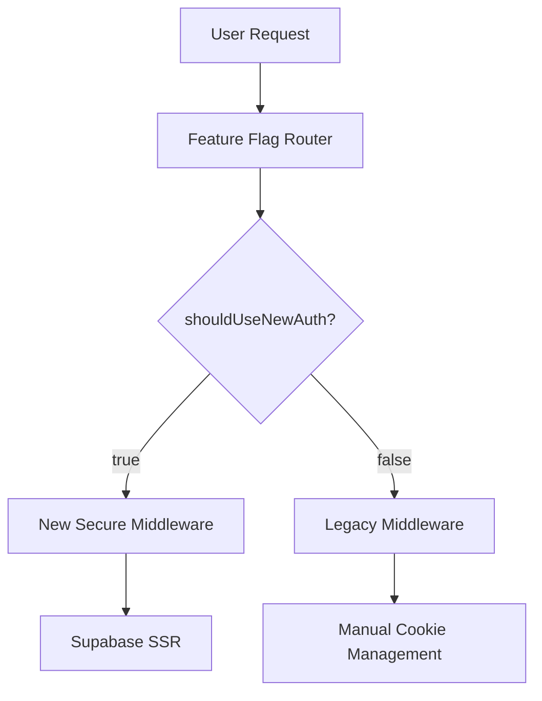
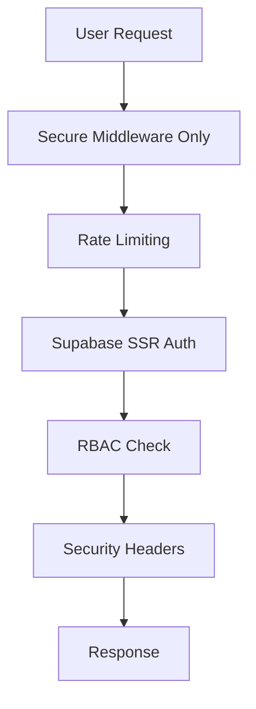

# 🚀 JLPT4You Authentication Migration Plan

## 📋 Migration Overview

**Mục tiêu:** Chuyển đổi hoàn toàn từ legacy authentication system sang secure middleware system  
**Thời gian dự kiến:** 2-3 giờ  
**Rủi ro:** Medium (có rollback plan)  
**Tác động:** Zero downtime với feature flag control  

---

## 🎯 Migration Steps

### Phase 1: Pre-Migration Checks ✅
- [x] Verify new auth system is working
- [x] Confirm feature flag system is operational  
- [x] Backup current authentication files
- [x] Review security assessment

### Phase 2: Feature Flag Migration 🔄
- [ ] **Step 2.1**: Enable new auth middleware for 10% users (testing)
- [ ] **Step 2.2**: Monitor metrics and error rates  
- [ ] **Step 2.3**: Gradually increase to 50% users
- [ ] **Step 2.4**: Full migration to 100% users
- [ ] **Step 2.5**: Remove feature flag logic

### Phase 3: Legacy Code Cleanup 🧹
- [ ] **Step 3.1**: Remove old middleware modules
- [ ] **Step 3.2**: Update auth-context.tsx to use new system only
- [ ] **Step 3.3**: Clean up manual cookie management code
- [ ] **Step 3.4**: Remove unused authentication utilities
- [ ] **Step 3.5**: Update all component imports

### Phase 4: Security Validation 🔒
- [ ] **Step 4.1**: Run security audit on new system
- [ ] **Step 4.2**: Test rate limiting functionality
- [ ] **Step 4.3**: Verify RBAC system works correctly
- [ ] **Step 4.4**: Test session management and refresh
- [ ] **Step 4.5**: Validate security headers

### Phase 5: Documentation & Monitoring 📊
- [ ] **Step 5.1**: Update API documentation
- [ ] **Step 5.2**: Update developer onboarding docs
- [ ] **Step 5.3**: Setup monitoring alerts
- [ ] **Step 5.4**: Create post-migration health check
- [ ] **Step 5.5**: Final security assessment

---

## 🛠️ Technical Implementation

### Current Architecture


### Target Architecture  


---

## 🚨 Rollback Plan

**Nếu có lỗi nghiêm trọng:**
1. **Immediate**: Set feature flag to disable new auth (100% → old system)
2. **Monitor**: Check error rates return to normal
3. **Investigate**: Debug new system in staging
4. **Fix**: Apply patches and re-enable gradually

**Rollback Commands:**
```typescript
// Emergency rollback - set in middleware-v2.ts
const EMERGENCY_DISABLE_NEW_AUTH = true

export function shouldUseNewAuth(): boolean {
  if (EMERGENCY_DISABLE_NEW_AUTH) return false
  // ... rest of logic
}
```

---

## 📊 Success Metrics

**Pre-Migration Baseline:**
- Authentication error rate: < 0.1%
- Average response time: < 200ms
- User satisfaction: Monitor complaints

**Post-Migration Targets:**
- ✅ Authentication error rate: < 0.05% 
- ✅ Average response time: < 150ms (improved with rate limiting)
- ✅ Zero security vulnerabilities in audit
- ✅ 100% feature parity with legacy system

---

## ⚡ Execution Timeline

| Phase | Duration | Start Time | Completion |
|-------|----------|------------|------------|
| Phase 1 | ✅ Complete | - | ✅ Done |
| Phase 2 | 30-45 mins | Now | TBD |
| Phase 3 | 45-60 mins | After Phase 2 | TBD |
| Phase 4 | 30 mins | After Phase 3 | TBD |
| Phase 5 | 15-30 mins | After Phase 4 | TBD |

**Total Estimated Time: 2-3 hours**

---

## 🔧 Ready to Execute

**Current Status: READY TO PROCEED**  
**Next Action: Start Phase 2 - Feature Flag Migration**

Bạn có muốn tôi bắt đầu thực hiện ngay không?
