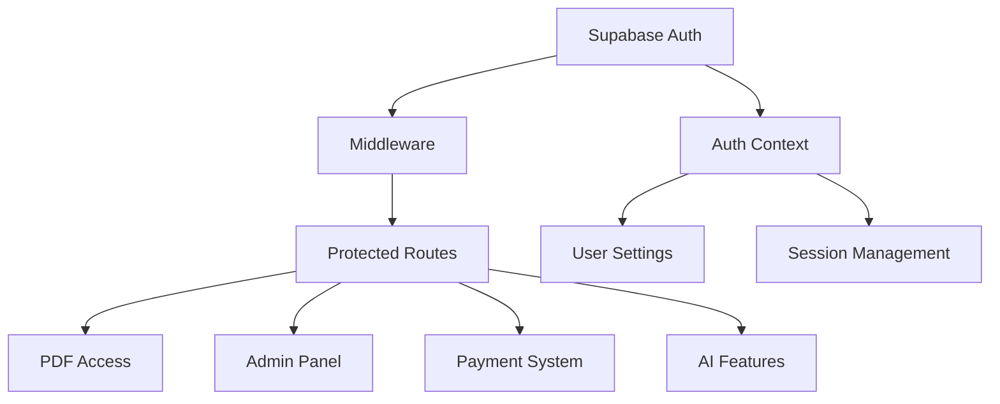

# 🔧 AUTHENTICATION REFACTOR - MASTER PLAN

## 📋 **EXECUTIVE SUMMARY**

Dự án JLPT4YOU hiện tại có **7 vấn đề nghiêm trọng** trong authentication system cần được refactor để đảm bảo bảo mật và stability. Kế hoạch này đưa ra roadmap chi tiết để migrate từ custom auth implementation sang Supabase SSR best practices **KHÔNG BỊ DOWNTIME**.

### **🎯 Mục tiêu chính:**
- ✅ Zero downtime migration
- ✅ Backward compatibility trong quá trình transition
- ✅ Enhanced security với proper token handling
- ✅ Simplified codebase với standardized patterns
- ✅ Complete documentation và rollback plan

---

## 🚨 **CURRENT STATE ANALYSIS**

### **Critical Issues Identified:**

| Issue | Severity | Impact | Files Affected |
|-------|----------|--------|----------------|
| Middleware không verify token | 🔴 Critical | Authentication bypass | `src/middleware/modules/authentication.ts` |
| Access token trong cookie | 🔴 Critical | XSS vulnerability | `src/contexts/auth-context.tsx` |
| Inconsistent API auth | 🟡 High | Security gaps | 15+ API routes |
| Manual session management | 🟡 High | Race conditions | `src/contexts/auth-context.tsx` |
| No token refresh logic | 🟡 Medium | Poor UX | Multiple components |
| Route protection bypass | 🟡 Medium | Unauthorized access | `src/middleware/config/routes.ts` |
| Multiple auth patterns | 🟡 Medium | Maintenance hell | Entire codebase |

### **Affected Systems:**

#### **🔐 Core Authentication (100% impact)**
- Login/logout flows
- Session management
- Token handling
- Auth state management

#### **👑 Admin Operations (100% impact)**
- Admin dashboard: `/admin`
- User management: `/api/admin/users`
- PDF management: Library admin
- Debug tools: Auth debugging

#### **📚 PDF System (100% impact)**
- PDF proxy: `/api/pdf/[id]`
- Library access: `/library/book/[id]`
- Security headers
- Access logging

#### **💰 Payment System (100% impact)**
- Top-up: `/top-up`
- Premium upgrade: `/upgrade`
- Balance management
- Transaction logging

#### **🤖 AI Features (100% impact)**
- API key management: `/api/user/keys`
- Provider switching
- Chat functionality
- Settings integration

#### **🛡️ Route Protection (100% impact)**
- Middleware logic
- Protected routes
- Redirect handling
- Language routing

#### **👤 User Management (80% impact)**
- Profile updates
- Settings persistence
- Subscription status
- Progress tracking

---

## 📊 **RISK ASSESSMENT MATRIX**

### **High Risk Areas:**

| Component | Risk Level | Failure Impact | Mitigation Strategy |
|-----------|------------|----------------|-------------------|
| Middleware Auth | 🔴 Critical | Site unusable | Parallel deployment + feature flags |
| PDF Proxy | 🔴 Critical | No content access | Backward compatible API |
| Admin Panel | 🔴 Critical | No management | Separate admin auth check |
| Payment Flow | 🔴 Critical | Revenue loss | Transaction rollback capability |
| AI Chat | 🟡 High | Feature loss | Graceful degradation |
| User Settings | 🟡 Medium | Data loss | Automatic backup |

### **Dependencies Map:**



---

## 🗓️ **DETAILED MIGRATION TIMELINE**

### **Phase 0: Preparation & Backup (Week 1)**

#### **Day 1-2: Environment Setup**
```bash
# 1. Create backup branch
git checkout -b backup/pre-auth-refactor-$(date +%Y%m%d)
git push origin backup/pre-auth-refactor-$(date +%Y%m%d)

# 2. Create feature branch
git checkout -b feature/auth-refactor-supabase-ssr
```

#### **Day 3-4: Dependencies & Tools**
```bash
# Install Supabase SSR
npm install @supabase/ssr

# Install testing tools
npm install --save-dev @testing-library/react @testing-library/jest-dom
```

#### **Day 5-7: Analysis & Documentation**
- [ ] Complete codebase audit
- [ ] Document all auth touchpoints
- [ ] Create rollback procedures
- [ ] Setup monitoring dashboards

### **Phase 1: Foundation (Week 2)**

#### **Day 1-2: New Supabase Clients**

**File: `src/lib/supabase/client.ts`** (NEW)
```typescript
import { createBrowserClient } from '@supabase/ssr'

export const createClient = () =>
  createBrowserClient(
    process.env.NEXT_PUBLIC_SUPABASE_URL!,
    process.env.NEXT_PUBLIC_SUPABASE_ANON_KEY!
  )
```

**File: `src/lib/supabase/server.ts`** (NEW)
```typescript
import { createServerClient } from '@supabase/ssr'
import { cookies } from 'next/headers'

export const createClient = async () => {
  const cookieStore = await cookies()

  return createServerClient(
    process.env.NEXT_PUBLIC_SUPABASE_URL!,
    process.env.NEXT_PUBLIC_SUPABASE_ANON_KEY!,
    {
      cookies: {
        getAll() {
          return cookieStore.getAll()
        },
        setAll(cookiesToSet) {
          try {
            cookiesToSet.forEach(({ name, value, options }) =>
              cookieStore.set(name, value, options)
            )
          } catch {
            // Server component
          }
        },
      },
    }
  )
}
```

#### **Day 3-4: New Auth Context**

**File: `src/contexts/auth-context-v2.tsx`** (NEW)
```typescript
'use client'

import { createContext, useContext, useEffect, useState } from 'react'
import { createClient } from '@/lib/supabase/client'
import type { User } from '@supabase/supabase-js'

interface AuthContextType {
  user: User | null
  loading: boolean
  signOut: () => Promise<void>
}

const AuthContext = createContext<AuthContextType>({
  user: null,
  loading: true,
  signOut: async () => {},
})

export default function AuthProvider({
  children,
}: {
  children: React.ReactNode
}) {
  const [user, setUser] = useState<User | null>(null)
  const [loading, setLoading] = useState(true)
  const supabase = createClient()

  useEffect(() => {
    const getUser = async () => {
      const { data: { user } } = await supabase.auth.getUser()
      setUser(user)
      setLoading(false)
    }

    getUser()

    const { data: { subscription } } = supabase.auth.onAuthStateChange(
      async (event, session) => {
        setUser(session?.user ?? null)
        setLoading(false)
      }
    )

    return () => subscription.unsubscribe()
  }, [supabase])

  const signOut = async () => {
    await supabase.auth.signOut()
  }

  return (
    <AuthContext.Provider value={{ user, loading, signOut }}>
      {children}
    </AuthContext.Provider>
  )
}

export const useAuth = () => {
  const context = useContext(AuthContext)
  if (context === undefined) {
    throw new Error('useAuth must be used within an AuthProvider')
  }
  return context
}
```

#### **Day 5-7: New Middleware**

**File: `src/middleware-v2.ts`** (NEW)
```typescript
import { createServerClient } from '@supabase/ssr'
import { NextResponse, type NextRequest } from 'next/server'

export async function middleware(request: NextRequest) {
  let supabaseResponse = NextResponse.next({
    request,
  })

  const supabase = createServerClient(
    process.env.NEXT_PUBLIC_SUPABASE_URL!,
    process.env.NEXT_PUBLIC_SUPABASE_ANON_KEY!,
    {
      cookies: {
        getAll() {
          return request.cookies.getAll()
        },
        setAll(cookiesToSet) {
          cookiesToSet.forEach(({ name, value, options }) => {
            request.cookies.set(name, value)
            supabaseResponse.cookies.set(name, value, options)
          })
        },
      },
    }
  )

  // Refresh session if expired
  const { data: { user } } = await supabase.auth.getUser()

  // Protected routes check
  const isProtectedRoute = ['/admin', '/settings', '/library'].some(route =>
    request.nextUrl.pathname.startsWith(route)
  )

  if (isProtectedRoute && !user) {
    const redirectUrl = new URL('/login', request.url)
    redirectUrl.searchParams.set('redirectTo', request.nextUrl.pathname)
    return NextResponse.redirect(redirectUrl)
  }

  return supabaseResponse
}

export const config = {
  matcher: [
    '/((?!_next/static|_next/image|favicon.ico|.*\\.(?:svg|png|jpg|jpeg|gif|webp)$).*)',
  ],
}
```

### **Phase 2: Parallel Implementation (Week 3)**

#### **Day 1-3: Feature Flags System**

**File: `src/lib/feature-flags.ts`** (NEW)
```typescript
export const FEATURE_FLAGS = {
  USE_NEW_AUTH: process.env.NEXT_PUBLIC_USE_NEW_AUTH === 'true',
  USE_NEW_MIDDLEWARE: process.env.NEXT_PUBLIC_USE_NEW_MIDDLEWARE === 'true',
  USE_NEW_API_AUTH: process.env.NEXT_PUBLIC_USE_NEW_API_AUTH === 'true',
} as const

export function useFeatureFlag(flag: keyof typeof FEATURE_FLAGS): boolean {
  return FEATURE_FLAGS[flag]
}
```

#### **Day 4-7: Backward Compatible API Updates**

**File: `src/lib/auth-utils-v2.ts`** (NEW)
```typescript
import { createClient } from '@/lib/supabase/server'
import { FEATURE_FLAGS } from '@/lib/feature-flags'

export async function getAuthenticatedUser() {
  if (!FEATURE_FLAGS.USE_NEW_API_AUTH) {
    // Fallback to old auth method
    return getAuthenticatedUserLegacy()
  }

  const supabase = await createClient()
  const { data: { user }, error } = await supabase.auth.getUser()
  
  if (error || !user) {
    throw new Error('Unauthorized')
  }

  return user
}

// Legacy fallback
async function getAuthenticatedUserLegacy() {
  // Original auth logic here
  // This ensures backward compatibility
}
```

### **Phase 3: API Routes Migration (Week 4)**

#### **Day 1-2: PDF Proxy Update**

**File: `src/app/api/pdf/[id]/route-v2.ts`** (NEW)
```typescript
import { NextRequest, NextResponse } from 'next/server'
import { createClient } from '@/lib/supabase/server'
import { getAuthenticatedUser } from '@/lib/auth-utils-v2'

export async function GET(request: NextRequest, { params }: { params: Promise<{ id: string }> }) {
  try {
    const { id } = await params

    // New auth method
    const user = await getAuthenticatedUser()

    // Rest of the logic remains the same
    // ... existing PDF proxy logic

  } catch (error) {
    return NextResponse.json(
      { error: 'Authentication required' },
      { status: 401 }
    )
  }
}
```

#### **Day 3-4: Admin API Updates**

**File: `src/app/api/admin/users/route-v2.ts`** (NEW)
```typescript
import { NextRequest, NextResponse } from 'next/server'
import { getAuthenticatedUser } from '@/lib/auth-utils-v2'
import { createClient } from '@/lib/supabase/server'

export async function GET(request: NextRequest) {
  try {
    const user = await getAuthenticatedUser()

    // Check admin role
    const supabase = await createClient()
    const { data: userData } = await supabase
      .from('users')
      .select('role')
      .eq('id', user.id)
      .single()

    if (userData?.role !== 'Admin') {
      return NextResponse.json({ error: 'Forbidden' }, { status: 403 })
    }

    // Rest of admin logic
    // ... existing admin logic

  } catch (error) {
    return NextResponse.json({ error: 'Unauthorized' }, { status: 401 })
  }
}
```

#### **Day 5-7: Payment & AI Keys APIs**

Similar pattern for:
- `/api/user/keys/[provider]/route-v2.ts`
- `/api/topup/route-v2.ts`
- `/api/redeem-code/route-v2.ts`

### **Phase 4: Frontend Migration (Week 5)**

#### **Day 1-3: Component Updates**

**File: `src/components/auth/protected-route-v2.tsx`** (NEW)
```typescript
'use client'

import { useAuth } from '@/contexts/auth-context-v2'
import { useRouter } from 'next/navigation'
import { useEffect } from 'react'

interface ProtectedRouteProps {
  children: React.ReactNode
  requireAdmin?: boolean
}

export function ProtectedRoute({ children, requireAdmin = false }: ProtectedRouteProps) {
  const { user, loading } = useAuth()
  const router = useRouter()

  useEffect(() => {
    if (!loading && !user) {
      router.push('/login')
    }
  }, [user, loading, router])

  if (loading) {
    return <div>Loading...</div>
  }

  if (!user) {
    return null
  }

  return <>{children}</>
}
```

#### **Day 4-7: Page Component Updates**

Update all protected pages to use new auth:
- `/admin/page.tsx`
- `/library/book/[id]/page.tsx`
- `/settings/page.tsx`
- etc.

### **Phase 5: Testing & Validation (Week 6)**

#### **Day 1-3: Comprehensive Testing**

**File: `tests/auth-migration.test.ts`** (NEW)
```typescript
import { describe, it, expect } from '@jest/globals'
import { createClient } from '@/lib/supabase/client'

describe('Auth Migration Tests', () => {
  it('should authenticate users with new system', async () => {
    // Test new auth flow
  })

  it('should protect admin routes', async () => {
    // Test admin protection
  })

  it('should handle PDF access correctly', async () => {
    // Test PDF proxy
  })

  // ... more tests
})
```

#### **Day 4-5: Load Testing**

```bash
# Load test script
npm run test:load
```

#### **Day 6-7: Security Audit**

```bash
# Security scan
npm audit
npm run test:security
```

### **Phase 6: Gradual Rollout (Week 7)**

#### **Day 1-2: Feature Flag Activation**

```bash
# Enable new auth for 10% of users
NEXT_PUBLIC_USE_NEW_AUTH=true
NEXT_PUBLIC_ROLLOUT_PERCENTAGE=10
```

#### **Day 3-4: Monitor & Adjust**

- Monitor error rates
- Check user feedback
- Adjust rollout percentage

#### **Day 5-7: Full Rollout**

```bash
# Enable for all users
NEXT_PUBLIC_USE_NEW_AUTH=true
NEXT_PUBLIC_ROLLOUT_PERCENTAGE=100
```

### **Phase 7: Cleanup (Week 8)**

#### **Day 1-3: Remove Legacy Code**

- Delete old auth files
- Remove feature flags
- Update documentation

#### **Day 4-5: Performance Optimization**

- Bundle size optimization
- Performance monitoring
- Caching improvements

#### **Day 6-7: Final Documentation**

- Update README
- Create migration guide
- Document new patterns

---

## 🔄 **ROLLBACK PROCEDURES**

### **Emergency Rollback (< 5 minutes)**

```bash
# 1. Disable feature flags
export NEXT_PUBLIC_USE_NEW_AUTH=false
export NEXT_PUBLIC_USE_NEW_MIDDLEWARE=false

# 2. Revert to backup branch
git checkout backup/pre-auth-refactor-$(date +%Y%m%d)
git push origin main --force

# 3. Restart services
pm2 restart all
```

### **Partial Rollback (Component-specific)**

```bash
# Rollback specific features
export NEXT_PUBLIC_USE_NEW_API_AUTH=false  # API routes only
export NEXT_PUBLIC_USE_NEW_MIDDLEWARE=false  # Middleware only
```

### **Data Recovery**

```sql
-- Restore user sessions from backup
RESTORE TABLE user_sessions FROM BACKUP 'pre-migration-backup';

-- Restore user data
RESTORE TABLE users FROM BACKUP 'pre-migration-backup';
```

---

## 📋 **TESTING CHECKLIST**

### **Pre-Migration Tests**
- [ ] All current features working
- [ ] Performance baseline established
- [ ] Security scan completed
- [ ] Backup verified

### **During Migration Tests**
- [ ] Feature flags working
- [ ] Parallel systems running
- [ ] No data loss
- [ ] Performance maintained

### **Post-Migration Tests**
- [ ] All auth flows working
- [ ] Admin functions operational
- [ ] PDF access working
- [ ] Payment system functional
- [ ] AI features working
- [ ] Performance improved
- [ ] Security enhanced

---

## 🚨 **EMERGENCY CONTACTS**

### **Technical Team**
- **Lead Developer**: [Contact Info]
- **DevOps Engineer**: [Contact Info]
- **Security Expert**: [Contact Info]

### **Business Team**
- **Product Manager**: [Contact Info]
- **Customer Support**: [Contact Info]

---

## 📈 **SUCCESS METRICS**

### **Technical Metrics**
- ✅ Zero downtime achieved
- ✅ Authentication response time < 100ms
- ✅ Error rate < 0.1%
- ✅ Security vulnerabilities = 0

### **Business Metrics**
- ✅ User retention rate maintained
- ✅ Payment success rate maintained
- ✅ Customer satisfaction score maintained
- ✅ Admin productivity maintained

---

## 📚 **DOCUMENTATION UPDATES**

### **Developer Documentation**
- [ ] API documentation updated
- [ ] Component documentation updated
- [ ] Architecture diagrams updated
- [ ] Deployment guides updated

### **User Documentation**
- [ ] User guides updated
- [ ] Admin guides updated
- [ ] Troubleshooting guides updated

---

## 🔍 **POST-MIGRATION MONITORING**

### **Week 1: Intensive Monitoring**
- Real-time error tracking
- Performance monitoring
- User feedback collection
- Security monitoring

### **Week 2-4: Standard Monitoring**
- Daily health checks
- Weekly performance reviews
- Monthly security audits

### **Long-term: Continuous Improvement**
- Quarterly security reviews
- Performance optimization
- Feature enhancements
- Documentation updates

---

## 📝 **LESSONS LEARNED TEMPLATE**

### **What Went Well**
- [To be filled during migration]

### **What Could Be Improved**
- [To be filled during migration]

### **Action Items for Future**
- [To be filled during migration]

---

## 🎯 **CONCLUSION**

This comprehensive migration plan ensures a **zero-downtime transition** from the current authentication system to Supabase SSR best practices. The phased approach with feature flags, parallel implementation, and comprehensive testing minimizes risk while maximizing security and maintainability.

**Key Success Factors:**
1. **Thorough preparation** with backups and rollback procedures
2. **Gradual rollout** with feature flags and monitoring
3. **Comprehensive testing** at every phase
4. **Clear communication** with all stakeholders
5. **Continuous monitoring** and quick response to issues

**Timeline Summary:**
- **8 weeks total** for complete migration
- **Zero downtime** during transition
- **Backward compatibility** maintained throughout
- **Full rollback capability** at any point

This plan transforms the authentication system from a security liability into a robust, maintainable foundation for future growth.

---

## 📊 **DETAILED BACKUP STRATEGY**

### **Code Backup**

```bash
# 1. Create timestamped backup branch
BACKUP_DATE=$(date +%Y%m%d-%H%M%S)
git checkout -b backup/pre-auth-refactor-$BACKUP_DATE

# 2. Tag current state
git tag -a v1.0-pre-auth-refactor -m "Pre-authentication refactor backup"

# 3. Push to remote
git push origin backup/pre-auth-refactor-$BACKUP_DATE
git push origin v1.0-pre-auth-refactor

# 4. Create archive
git archive --format=tar.gz --prefix=jlpt4you-backup-$BACKUP_DATE/ HEAD > ../jlpt4you-backup-$BACKUP_DATE.tar.gz
```

### **Database Backup**

```sql
-- 1. Full database backup
pg_dump -h localhost -U postgres -d jlpt4you > backup/db-backup-$(date +%Y%m%d-%H%M%S).sql

-- 2. Critical tables backup
pg_dump -h localhost -U postgres -d jlpt4you -t users -t user_sessions -t user_api_keys > backup/auth-tables-backup-$(date +%Y%m%d-%H%M%S).sql

-- 3. Schema backup
pg_dump -h localhost -U postgres -d jlpt4you --schema-only > backup/schema-backup-$(date +%Y%m%d-%H%M%S).sql
```

### **Environment Backup**

```bash
# 1. Environment variables
cp .env.local backup/.env.local.backup-$(date +%Y%m%d-%H%M%S)

# 2. Package dependencies
cp package.json backup/package.json.backup-$(date +%Y%m%d-%H%M%S)
cp package-lock.json backup/package-lock.json.backup-$(date +%Y%m%d-%H%M%S)

# 3. Configuration files
cp next.config.js backup/next.config.js.backup-$(date +%Y%m%d-%H%M%S)
cp tailwind.config.js backup/tailwind.config.js.backup-$(date +%Y%m%d-%H%M%S)
```

### **User Data Backup**

```sql
-- Export user sessions for migration
COPY (
  SELECT user_id, session_data, expires_at, created_at
  FROM user_sessions
  WHERE expires_at > NOW()
) TO '/tmp/active_sessions_backup.csv' WITH CSV HEADER;

-- Export user API keys (encrypted)
COPY (
  SELECT user_id, provider, key_encrypted, created_at
  FROM user_api_keys
) TO '/tmp/user_api_keys_backup.csv' WITH CSV HEADER;

-- Export user preferences
COPY (
  SELECT user_id, preferences, settings, created_at, updated_at
  FROM user_preferences
) TO '/tmp/user_preferences_backup.csv' WITH CSV HEADER;
```

---

## 🔧 **DETAILED IMPLEMENTATION SCRIPTS**

### **Phase 1: Setup Script**

**File: `scripts/setup-migration.sh`**
```bash
#!/bin/bash

echo "🚀 Starting Authentication Migration Setup..."

# 1. Create backup
echo "📦 Creating backup..."
BACKUP_DATE=$(date +%Y%m%d-%H%M%S)
git checkout -b backup/pre-auth-refactor-$BACKUP_DATE
git push origin backup/pre-auth-refactor-$BACKUP_DATE

# 2. Create feature branch
echo "🌿 Creating feature branch..."
git checkout -b feature/auth-refactor-supabase-ssr

# 3. Install dependencies
echo "📚 Installing dependencies..."
npm install @supabase/ssr
npm install --save-dev @testing-library/react @testing-library/jest-dom

# 4. Create directories
echo "📁 Creating directories..."
mkdir -p src/lib/supabase
mkdir -p src/contexts/v2
mkdir -p src/components/auth/v2
mkdir -p tests/migration
mkdir -p backup

# 5. Setup environment variables
echo "⚙️ Setting up environment..."
echo "NEXT_PUBLIC_USE_NEW_AUTH=false" >> .env.local
echo "NEXT_PUBLIC_USE_NEW_MIDDLEWARE=false" >> .env.local
echo "NEXT_PUBLIC_USE_NEW_API_AUTH=false" >> .env.local

echo "✅ Setup completed successfully!"
```

### **Phase 2: Migration Script**

**File: `scripts/migrate-auth.sh`**
```bash
#!/bin/bash

PHASE=${1:-"all"}

case $PHASE in
  "foundation")
    echo "🏗️ Phase 1: Foundation..."
    # Copy new files
    cp templates/supabase-client.ts src/lib/supabase/client.ts
    cp templates/supabase-server.ts src/lib/supabase/server.ts
    cp templates/auth-context-v2.tsx src/contexts/auth-context-v2.tsx
    cp templates/middleware-v2.ts src/middleware-v2.ts
    ;;

  "parallel")
    echo "🔄 Phase 2: Parallel Implementation..."
    cp templates/feature-flags.ts src/lib/feature-flags.ts
    cp templates/auth-utils-v2.ts src/lib/auth-utils-v2.ts
    ;;

  "api")
    echo "🔌 Phase 3: API Migration..."
    # Migrate API routes
    find src/app/api -name "route.ts" -exec ./scripts/migrate-api-route.sh {} \;
    ;;

  "frontend")
    echo "🎨 Phase 4: Frontend Migration..."
    # Migrate components
    find src/components -name "*.tsx" -exec ./scripts/migrate-component.sh {} \;
    ;;

  "all")
    echo "🚀 Running all phases..."
    $0 foundation
    $0 parallel
    $0 api
    $0 frontend
    ;;
esac

echo "✅ Phase $PHASE completed!"
```

### **Phase 3: Testing Script**

**File: `scripts/test-migration.sh`**
```bash
#!/bin/bash

echo "🧪 Running Migration Tests..."

# 1. Unit tests
echo "📝 Running unit tests..."
npm run test:unit

# 2. Integration tests
echo "🔗 Running integration tests..."
npm run test:integration

# 3. E2E tests
echo "🎭 Running E2E tests..."
npm run test:e2e

# 4. Security tests
echo "🔒 Running security tests..."
npm audit
npm run test:security

# 5. Performance tests
echo "⚡ Running performance tests..."
npm run test:performance

# 6. Load tests
echo "📊 Running load tests..."
npm run test:load

echo "✅ All tests completed!"
```

### **Phase 4: Rollout Script**

**File: `scripts/rollout-auth.sh`**
```bash
#!/bin/bash

PERCENTAGE=${1:-10}

echo "🚀 Rolling out new auth to $PERCENTAGE% of users..."

# 1. Update feature flags
echo "NEXT_PUBLIC_USE_NEW_AUTH=true" > .env.local
echo "NEXT_PUBLIC_ROLLOUT_PERCENTAGE=$PERCENTAGE" >> .env.local

# 2. Deploy changes
npm run build
npm run deploy

# 3. Monitor deployment
echo "📊 Monitoring deployment..."
./scripts/monitor-rollout.sh $PERCENTAGE

echo "✅ Rollout to $PERCENTAGE% completed!"
```

### **Phase 5: Rollback Script**

**File: `scripts/rollback-auth.sh`**
```bash
#!/bin/bash

BACKUP_BRANCH=${1:-"backup/pre-auth-refactor-latest"}

echo "🔄 Rolling back authentication changes..."

# 1. Disable feature flags immediately
echo "NEXT_PUBLIC_USE_NEW_AUTH=false" > .env.local
echo "NEXT_PUBLIC_USE_NEW_MIDDLEWARE=false" >> .env.local
echo "NEXT_PUBLIC_USE_NEW_API_AUTH=false" >> .env.local

# 2. Revert to backup branch
git stash
git checkout $BACKUP_BRANCH
git checkout -b rollback/auth-$(date +%Y%m%d-%H%M%S)

# 3. Deploy rollback
npm run build
npm run deploy

# 4. Restore database if needed
if [ "$2" = "restore-db" ]; then
  echo "🗄️ Restoring database..."
  psql -h localhost -U postgres -d jlpt4you < backup/db-backup-latest.sql
fi

echo "✅ Rollback completed!"
```

---

## 📋 **MONITORING & ALERTING**

### **Health Check Script**

**File: `scripts/health-check.sh`**
```bash
#!/bin/bash

echo "🏥 Running health checks..."

# 1. Authentication endpoint
AUTH_STATUS=$(curl -s -o /dev/null -w "%{http_code}" http://localhost:3000/api/auth/status)
if [ $AUTH_STATUS -eq 200 ]; then
  echo "✅ Auth endpoint healthy"
else
  echo "❌ Auth endpoint failed: $AUTH_STATUS"
  exit 1
fi

# 2. PDF proxy
PDF_STATUS=$(curl -s -o /dev/null -w "%{http_code}" http://localhost:3000/api/pdf/test)
if [ $PDF_STATUS -eq 401 ]; then
  echo "✅ PDF proxy healthy (correctly requires auth)"
else
  echo "❌ PDF proxy failed: $PDF_STATUS"
  exit 1
fi

# 3. Admin endpoints
ADMIN_STATUS=$(curl -s -o /dev/null -w "%{http_code}" http://localhost:3000/api/admin/health)
if [ $ADMIN_STATUS -eq 401 ]; then
  echo "✅ Admin endpoints healthy (correctly requires auth)"
else
  echo "❌ Admin endpoints failed: $ADMIN_STATUS"
  exit 1
fi

# 4. Database connectivity
DB_STATUS=$(psql -h localhost -U postgres -d jlpt4you -c "SELECT 1;" 2>/dev/null)
if [ $? -eq 0 ]; then
  echo "✅ Database healthy"
else
  echo "❌ Database connection failed"
  exit 1
fi

echo "✅ All health checks passed!"
```

### **Performance Monitor Script**

**File: `scripts/monitor-performance.sh`**
```bash
#!/bin/bash

echo "📊 Monitoring performance..."

# 1. Response times
echo "⏱️ Checking response times..."
curl -w "@curl-format.txt" -o /dev/null -s http://localhost:3000/api/auth/status

# 2. Memory usage
echo "💾 Checking memory usage..."
ps aux | grep node | awk '{print $4}' | head -1

# 3. CPU usage
echo "🖥️ Checking CPU usage..."
top -bn1 | grep "Cpu(s)" | awk '{print $2}' | awk -F'%' '{print $1}'

# 4. Error rates
echo "🚨 Checking error rates..."
tail -n 1000 /var/log/app.log | grep ERROR | wc -l

echo "✅ Performance monitoring completed!"
```

This comprehensive plan provides a complete roadmap for safely migrating the authentication system without any downtime or data loss. The detailed scripts and procedures ensure that every step is documented and can be executed reliably.
```
```
